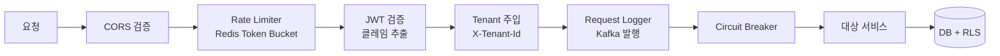
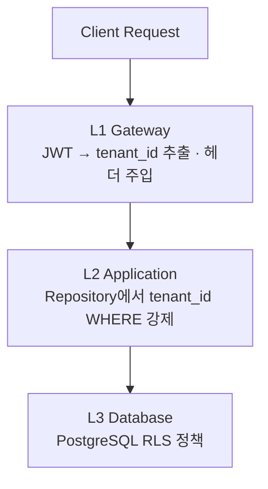

# 요청 하나가 흐르는 길 (동기)

사용자가 버튼을 누르면, 그 요청은 정해진 관문들을 차례로 통과해 서비스에 닿고 DB까지 내려갑니다. 이 "동기 요청" 경로를 따라가 봅니다. (응답을 기다리지 않는 "비동기 이벤트"는 다음 장에서.)

## 게이트웨이 필터 체인

모든 요청은 Cloudflare를 지나 **Spring Cloud Gateway**의 필터 체인을 통과합니다.

1. **CORS** — 허용된 Origin인지 검증
2. **Rate Limiter** — Redis Token Bucket으로 플랜별(Free/Pro/Team) 요청량 제한
3. **JWT 검증** — Access Token 서명·만료 검증 후 클레임 추출
4. **Tenant Resolver** — JWT에서 `tenant_id`를 꺼내 `X-Tenant-Id` 헤더로 주입
5. **Request Logger** — 요청 메타데이터를 Kafka로 발행(감사용)
6. **Circuit Breaker** — 대상 서비스 장애 시 빠르게 차단(Resilience4j)

> 💡 **개념: JWT**
> 로그인하면 서버가 사용자·테넌트 정보를 담아 서명한 토큰(JWT)을 줍니다. 이후 요청은 이 토큰만 보내면 되고, 게이트웨이가 서명을 검증해 "누가, 어느 테넌트로" 들어왔는지 신뢰합니다. 비밀번호를 매번 보낼 필요가 없습니다.

## 멀티테넌시 3단계 격리

테넌트 간 데이터가 절대 섞이지 않도록, **세 겹의 방어선**을 둡니다. 한 층이 빠져도 다음 층이 막습니다.

| 레벨 | 구현 | 목적 |
|---|---|---|
| **L1 Gateway** | JWT → `tenant_id` 추출 + `X-Tenant-Id` 주입 | 인증된 테넌트만 진입 |
| **L2 Application** | BaseRepository가 모든 쿼리에 `tenant_id` 조건 강제 | 코드 레벨 격리 |
| **L3 Database** | PostgreSQL RLS(Row-Level Security) 정책 | DB 레벨 최종 방어선 |

> 💡 **개념: RLS / 멀티테넌시 격리**
> RLS는 PostgreSQL이 "이 연결은 tenant_id=X만 볼 수 있다"를 행 단위로 강제하는 기능입니다. 애플리케이션 코드가 실수로 조건을 빠뜨려도, DB가 마지막으로 다른 테넌트의 행을 가려 줍니다. "이중·삼중 방어(defense in depth)"의 전형입니다.

## 세부 스펙은 원본으로

플랜별 정확한 Rate Limit 수치, JWT 클레임 구조, RLS 정책 SQL 등 정밀 정보는 이 문서에서 재작성하지 않습니다. 아래 원본을 보세요.

## 다음 읽을거리

- [03 프로젝트 아키텍처 정의서](https://github.com/team-project-final/documents/wiki/03_프로젝트_아키텍처_정의서) — §3.2.3 Gateway, §3.3 멀티테넌시
- [03-B 내부외부 경계 보안 명세](https://github.com/team-project-final/documents/wiki/03-B_내부외부_경계_보안_명세)
- [04 API 명세서](https://github.com/team-project-final/documents/wiki/04_API_명세서) — 엔드포인트·공통 규약·에러 코드
