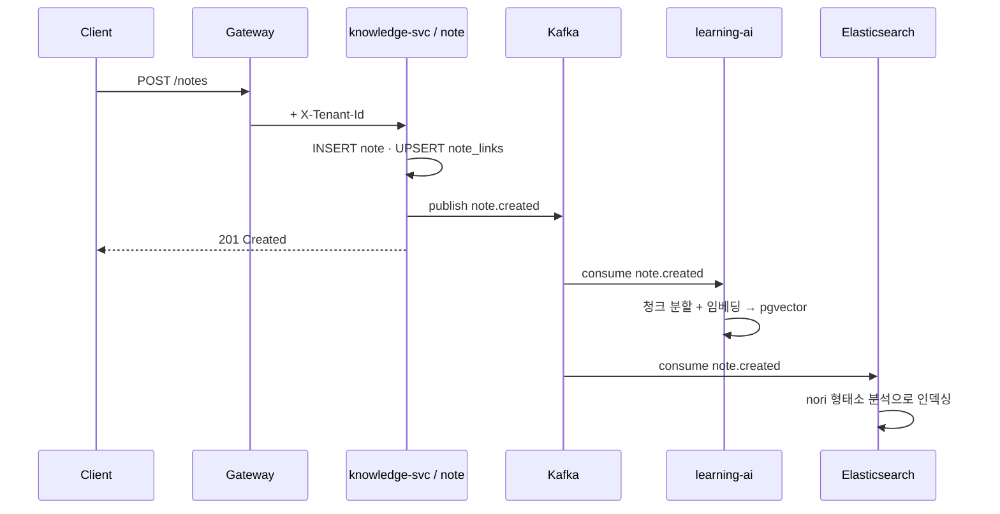

# 이벤트가 흐르는 길 (비동기)

앞 장의 동기 요청은 "물어보고 답을 기다리는" 길이었습니다. 이 장은 "한 번 알리고 각자 알아서 처리하는" **비동기 이벤트** 길입니다. SYNAPSE의 서비스들이 서로 직접 호출하지 않고도 협력하는 비결입니다.

> 💡 **개념: 이벤트 기반 아키텍처 / Producer·Consumer**
> 한 서비스가 "무슨 일이 일어났다"는 사실(이벤트)을 메시지 큐(Kafka)에 **발행(produce)** 하면, 관심 있는 다른 서비스들이 그걸 **구독(consume)** 해 각자 처리합니다. 발행자는 누가 받는지 몰라도 됩니다. 이렇게 하면 서비스 간 결합이 느슨해지고(한쪽이 느려도 다른 쪽이 안 멈춤), 나중에 소비자를 추가하기도 쉽습니다.

## 왜 Kafka인가

"노트 한 개 저장"이라는 단일 행동이 여러 후속 작업을 부릅니다 — AI 임베딩 생성, 검색 색인, (경우에 따라) 알림. 이걸 노트 서비스가 전부 동기로 직접 호출하면, 한 작업이 느려질 때 사용자 응답까지 느려지고 서비스들이 강하게 얽힙니다. 대신 노트 서비스는 `note.created` 이벤트만 발행하고 **즉시 201을 응답**합니다. 나머지는 소비자들이 비동기로 처리합니다.

## 대표 흐름: `note.created`

핵심은 **응답(201)이 후속 작업보다 먼저 돌아간다**는 점입니다. 사용자는 기다리지 않고, 임베딩과 검색 색인은 뒤에서 채워집니다.

## 이벤트 스키마는 계약이다

이벤트는 서비스 간 **계약**입니다. 함부로 바꾸면 소비자가 깨집니다. 그래서:

- 모든 이벤트는 **CloudEvents** 호환 JSON 형식(공통 메타 + `data` 페이로드)
- 페이로드는 `synapse-shared` 레포의 **Avro 스키마(.avsc)** 로 정식 정의
- **Confluent Schema Registry**가 진화 호환성을 검증(전역 BACKWARD 모드)
- 금지: 필드 이름 변경 · 필수 필드 삭제 · default 없는 필수 필드 추가 · enum 값 제거

대표 토픽(일부): `note.created/updated/deleted`, `card.reviewed`, `card.review.due`, `user.registered`, `billing.subscription.changed`, `gamification.xp.earned/badge.earned/level.up`, `community.*`, `graph.notes.linked`.

## 다음 읽을거리

- [03 프로젝트 아키텍처 정의서](https://github.com/team-project-final/documents/wiki/03_프로젝트_아키텍처_정의서) — §3.4 이벤트 기반 통합, 토픽 producer/consumer 매핑
- [03-C 이벤트 스키마 진화 가이드](https://github.com/team-project-final/documents/wiki/03-C_이벤트_스키마_진화_가이드)
- [03-D 서비스간 호출 어댑터 표준](https://github.com/team-project-final/documents/wiki/03-D_서비스간_호출_어댑터_표준)
