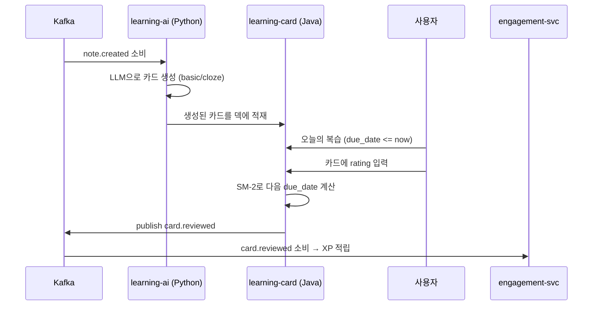
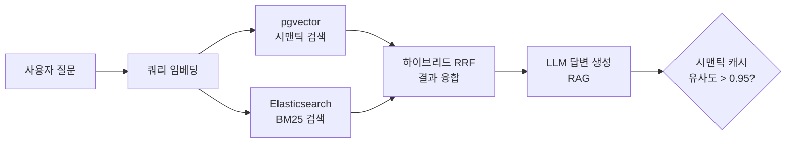

# 핵심 유저 플로우 E2E

앞의 두 장에서 동기/비동기 경로를 배웠습니다. 이제 그 둘이 합쳐져 **실제 기능 하나가 여러 서비스를 횡단하며 완성되는** 모습을 3개 시나리오로 봅니다. 각 시나리오마다 "어떤 서비스·이벤트가 관여하는지"를 표시합니다.

## 시나리오 1 — 노트 작성 → 검색 가능

> 관여: knowledge-svc(note) → Kafka(`note.created`) → learning-ai(임베딩) + knowledge-svc(ES 인덱싱)

[05. 이벤트가 흐르는 길]의 `note.created` 흐름이 그대로 이 시나리오입니다. 노트를 저장하면 즉시 201을 받고, 뒤에서 **시맨틱 검색용 임베딩(pgvector)** 과 **전문 검색용 색인(Elasticsearch + nori)** 이 채워집니다. 잠시 후 사용자는 그 노트를 키워드로도, 의미로도 찾을 수 있게 됩니다.

## 시나리오 2 — AI 자동 카드 생성 → SRS 복습

> 관여: learning-ai(카드 생성) → learning-card(덱 적재·SM-2) → Kafka(`card.reviewed`) → engagement-svc(XP)

노트만 썼는데 복습 카드가 자동으로 생기고, 복습할 때마다 XP가 쌓입니다.

> 💡 **개념: SRS / SM-2**
> SRS(Spaced Repetition System)는 "잊을 때쯤" 다시 보여 주는 복습 기법입니다. SM-2는 사용자가 매긴 난이도(rating)로 다음 복습 간격을 계산하는 고전 알고리즘입니다. 쉬우면 간격이 길어지고, 어려우면 짧아집니다.

## 시나리오 3 — RAG 질의응답

> 관여: learning-ai(임베딩·검색·LLM), pgvector + Elasticsearch

질문을 임베딩해 **시맨틱 검색(pgvector)** 과 **키워드 검색(BM25)** 을 동시에 돌리고, 두 결과를 RRF로 융합한 뒤, 그 근거로 LLM이 답을 만듭니다. 비슷한 질문이 이미 있었다면 시맨틱 캐시(코사인 유사도 > 0.95)로 비용을 아낍니다.

> 💡 **개념: RAG / 하이브리드 검색(RRF)**
> RAG(Retrieval-Augmented Generation)는 "먼저 내 자료에서 관련 문서를 찾고(retrieval), 그걸 근거로 답을 생성(generation)"하는 방식입니다. 환각을 줄이고 출처를 댈 수 있습니다. RRF(Reciprocal Rank Fusion)는 의미 검색과 키워드 검색의 순위를 합쳐 더 좋은 결과를 뽑는 기법입니다.

## 다음 읽을거리

- [05 화면 흐름 시퀀스 다이어그램](https://github.com/team-project-final/documents/wiki/05_화면_흐름_시퀀스_다이어그램) — 핵심 유저 플로우 시퀀스
- [synapse-learning-svc ARCHITECTURE](https://github.com/team-project-final/documents/wiki/synapse-learning-svc_ARCHITECTURE)
