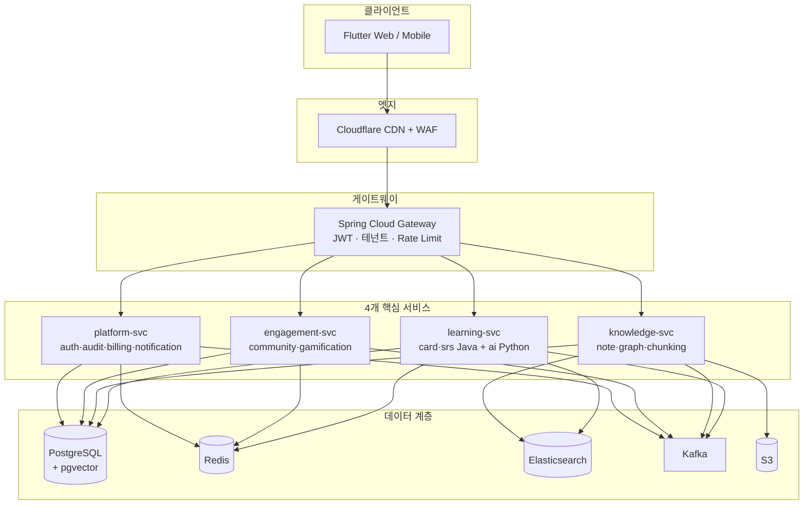

# MSA 입문 + 큰 그림

이 장을 읽고 나면 "SYNAPSE는 4개의 서비스가 게이트웨이 뒤에서 데이터 저장소를 나눠 쓰는 시스템"이라는 한 장의 그림이 머릿속에 남습니다.

> 💡 **개념: 모놀리식 vs MSA**
> **모놀리식**은 모든 기능이 하나의 배포 단위(한 덩어리 앱)에 들어 있는 구조입니다. 단순하지만 한 곳을 고치려면 전체를 다시 배포해야 하고, 트래픽이 몰리는 일부만 확장하기 어렵습니다.
> **MSA(Microservice Architecture)**는 기능을 독립 배포 가능한 작은 서비스들로 쪼갠 구조입니다. 서비스별 독립 배포·독립 확장·장애 격리가 가능해지는 대신, 네트워크 통신·데이터 정합성·운영 복잡도라는 비용이 따라옵니다.

## 왜 4개인가 — "10개를 4개로 합친" 결정

SYNAPSE는 원래 10개의 마이크로서비스로 설계했지만, **ADR-001 / ADR-002**(채택일 2026-05-09)로 **4개의 굵은 서비스로 통합**했습니다. 각 서비스 *내부*는 Spring Modulith 모듈로 나눠 경계를 유지합니다.

합친 이유는:

1. **콘웨이 법칙** — 팀이 7명인데 서비스가 10개면 한 사람이 여러 서비스를 떠안아 오너십이 흐려집니다. 서비스 수를 사람 수에 맞춰 "1트랙 = 1서비스(또는 2명)"로 정렬했습니다.
2. **운영 비용 ~30% 절감** — 서비스 수가 줄면 배포 파이프라인·모니터링·인프라 리소스가 함께 줄어듭니다.
3. **미래 분리 옵션 보존** — 내부를 모듈로 나눠 뒀기 때문에, 나중에 특정 모듈에 트래픽이 몰리면 그 모듈만 별도 서비스로 떼어낼 수 있습니다.

> 💡 **개념: Spring Modulith / 모듈러 모놀리식**
> 한 서비스 안을 명확한 모듈로 나누고, 모듈 간 의존 규칙을 ArchUnit 테스트로 CI에서 자동 검증합니다. "지금은 한 배포 단위지만 언제든 쪼갤 수 있는" 절충안입니다.

## 전체 아키텍처 한 장

## 레이어를 한 문단씩

- **클라이언트(Flutter)** — 하나의 코드베이스로 Web·iOS·Android를 모두 빌드합니다. 자세히는 [07. 프론트엔드 연결].
- **엣지(Cloudflare)** — 정적 자산 캐싱(CDN), 방화벽(WAF), DDoS 방어, TLS 종단. 모든 요청의 첫 관문입니다.
- **게이트웨이(Spring Cloud Gateway)** — 인증(JWT 검증), 테넌트 식별, 요청량 제한(Rate Limit)을 한 곳에서 처리하고 알맞은 서비스로 라우팅합니다. 자세히는 [04. 요청 하나가 흐르는 길].
- **4개 핵심 서비스** — 다음 장 [03. 4개 서비스 소개]에서 한 명씩 소개합니다.
- **데이터 계층** — 서비스들이 용도에 맞게 나눠 쓰는 저장소들(관계형 DB·캐시·검색엔진·메시지큐·파일 저장소). 자세히는 [08. 데이터·배포·관측성].

## 다음 읽을거리

- [03 프로젝트 아키텍처 정의서](https://github.com/team-project-final/documents/wiki/03_프로젝트_아키텍처_정의서) — 시스템 구성도, 레이어 상세, ADR 반영본
- [18 기술 스택 정의서](https://github.com/team-project-final/documents/wiki/18_기술_스택_정의서) — 기술 선택 이유와 대안 비교
- [09 Git 규칙 정의서](https://github.com/team-project-final/documents/wiki/09_Git_규칙_정의서) — ADR-001/002 전문(§0.1 / Appendix A·B)
