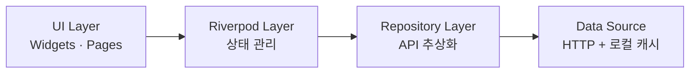

# 프론트엔드 연결

백엔드 4개 서비스를 봤으니, 이제 사용자가 실제로 만지는 **Flutter 앱**이 그 뒤에 어떻게 붙는지 봅니다.

## 한 코드베이스, 세 플랫폼

SYNAPSE 프론트엔드는 Flutter 3.x 하나로 **Web · iOS · Android**를 모두 빌드합니다.

| 플랫폼 | 빌드 | 배포 |
|---|---|---|
| Web | Flutter Web (CanvasKit) | Cloudflare Pages |
| iOS | Flutter iOS | App Store |
| Android | Flutter Android | Google Play |

## 4계층 구조

앱 내부는 책임에 따라 4계층으로 나뉩니다.

- **UI** — 화면을 그리는 위젯/페이지. 상태는 직접 안 들고 Riverpod에서 읽음
- **Riverpod** — 화면 상태와 비즈니스 상태를 관리(로딩/에러/데이터)
- **Repository** — "노트를 가져온다" 같은 의도를 표현하는 추상 인터페이스. UI는 HTTP를 몰라도 됨
- **Data Source** — 실제 HTTP 호출과 로컬 캐시

> 💡 **개념: 상태관리(Riverpod) / Repository 패턴**
> **Riverpod**은 "이 데이터가 바뀌면 그걸 쓰는 위젯만 다시 그린다"를 선언적으로 관리하는 상태관리 라이브러리입니다. **Repository 패턴**은 데이터를 어디서(서버/캐시) 어떻게(HTTP/DB) 가져오는지를 한 곳에 숨겨, UI는 "무엇을 원하는지"만 말하게 합니다. 둘 다 "관심사 분리"로 테스트와 변경을 쉽게 만듭니다.

## 백엔드로 붙는 법

- 모든 API 호출은 **Cloudflare → Gateway**를 거칩니다. 프론트는 개별 서비스 주소를 몰라도 되고, 게이트웨이가 알맞은 서비스로 라우팅합니다([04. 요청 하나가 흐르는 길]).
- 인증 토큰은 보안을 위해 분리 저장합니다 — **Refresh Token은 httpOnly Cookie**(JS에서 접근 불가), **Access Token은 메모리**.

> 참고: 지금 보고 있는 이 온보딩 포털도 Flutter Web 앱입니다. 다만 본 제품(synapse-frontend)과는 별개의 작은 정적 사이트입니다.

## 다음 읽을거리

- [synapse-frontend ARCHITECTURE](https://github.com/team-project-final/documents/wiki/synapse-frontend_ARCHITECTURE)
- `documents/docs/onboarding/05-frontend.md` — 프론트엔드 합류 가이드
- [06 화면 기능 정의서](https://github.com/team-project-final/documents/wiki/06_화면_기능_정의서) · DESIGN.md(디자인 시스템)
