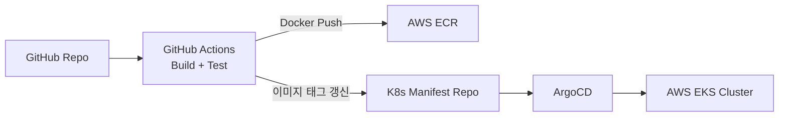

# 데이터·배포·관측성

서비스와 흐름을 봤으니, 이들이 **어디에 데이터를 두고**, **어떻게 배포되며**, **어떻게 관찰되는지** 마무리로 정리합니다.

## 데이터 저장소 — 용도별로 나눠 쓴다

MSA에서는 한 DB에 모든 걸 넣지 않고, 일에 맞는 저장소를 골라 씁니다.

| 저장소 | 용도 |
|---|---|
| **PostgreSQL 16 + pgvector** | 주 데이터(노트·카드·사용자 등) + 임베딩 벡터(시맨틱 검색) |
| **Redis 7** | 캐시, 세션/Refresh Token 조회, 리더보드(Sorted Set), Rate Limit 토큰 버킷 |
| **Elasticsearch 8 + nori** | 한국어 형태소 분석 기반 전문 검색 |
| **Kafka 3.x** | 서비스 간 비동기 이벤트 메시지 |
| **AWS S3** | 노트 첨부파일(Presigned URL로 업로드/다운로드) |

## 배포 — GitOps로 자동화

- 코드를 push하면 CI가 빌드·테스트 후 Docker 이미지를 ECR에 올리고, K8s 매니페스트 레포의 이미지 태그를 갱신합니다.
- **ArgoCD**가 매니페스트 레포를 감시하다가 변경을 클러스터에 반영합니다.
- **ApplicationSet matrix**로 5개 서비스(platform / engagement / knowledge / learning-card / learning-ai) × 3개 환경(dev / staging / prod) = 15개 Application을 한 번에 정의합니다.
- **dev는 자동 동기화(autoSync)**, **staging·prod는 수동 승인**.

> 💡 **개념: GitOps / 컨테이너·쿠버네티스**
> **컨테이너**는 앱과 실행 환경을 한 상자에 담아 "어디서나 똑같이 도는" 단위입니다. **쿠버네티스(K8s)** 는 그 컨테이너 수십 개를 자동으로 배치·확장·복구하는 오케스트레이터입니다. **GitOps**는 "원하는 상태(K8s 매니페스트)를 git에 적어 두면 도구(ArgoCD)가 클러스터를 그 상태로 맞춘다"는 운영 방식입니다. 배포 이력이 곧 git 이력이 됩니다.

## 관측성 — 무슨 일이 일어나는지 본다

| 계층 | 도구 | 목적 |
|---|---|---|
| Metrics | Prometheus + Grafana | CPU/메모리/RPS/지연시간 |
| Logging | Fluent Bit → CloudWatch | 구조화 로그 수집 |
| Tracing | OpenTelemetry → Jaeger | 분산 추적(요청이 서비스들을 거친 경로) |
| Error/APM | Sentry | 에러 추적 + 성능 모니터링 |

> 💡 **개념: 분산 추적(Distributed Tracing)**
> MSA에서는 요청 하나가 여러 서비스를 거치므로, "어디서 느려졌나"를 알기 어렵습니다. 추적 ID를 요청에 붙여 서비스 간 경로와 각 구간 소요시간을 한 줄로 이어 보여 주는 게 분산 추적입니다.

## 다음 읽을거리

- [14 배포 가이드](https://github.com/team-project-final/documents/wiki/14_배포_가이드) — CI/CD, Blue/Green, 롤백
- [16 운영 메뉴얼](https://github.com/team-project-final/documents/wiki/16_운영_메뉴얼) — 모니터링·장애 대응·백업/복구
- [10 환경 설정 템플릿](https://github.com/team-project-final/documents/wiki/10_환경_설정_템플릿) — 환경 매트릭스·Docker Compose
