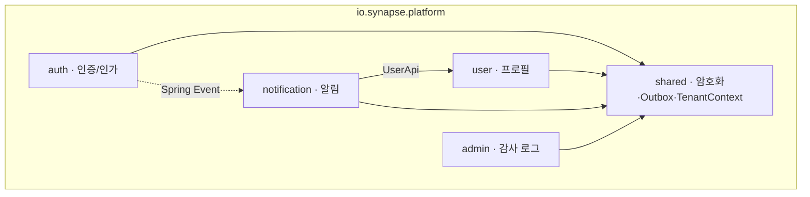
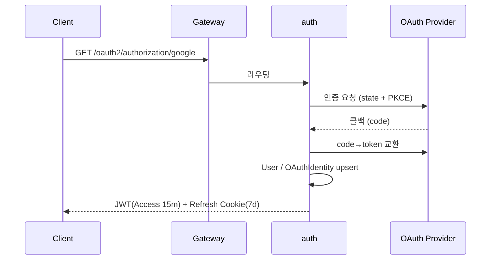

# platform-svc 상세

플랫폼의 **핵심 기반(cross-cutting) 서비스**. 인증·인가, 사용자, 알림, 감사를 담당합니다. 비즈니스 로직은 단순한 편이지만 외부 SaaS(OAuth·FCM·SES) 통합이 많습니다.

## 한눈 요약

| 항목 | 값 |
|---|---|
| 스택 | Java 21, Spring Boot 4.0, Spring Modulith 1.3, jjwt 0.12(RS256), Gradle Kotlin DSL |
| 저장소 | PostgreSQL 16 · Redis 7 · Kafka(AWS MSK) |
| 배포 | 단일 Spring Boot 앱 + 단일 Dockerfile(`synapse-platform-svc`), 단일 Deployment + HPA(CPU+요청률) |
| 테스트 | JUnit 5 + Testcontainers + Spring Modulith verification |
| 정적분석 | Checkstyle + Spotbugs |

> 💡 **개념: 헥사고날 / Port·Adapter (03-D 표준)**
> 네 서비스가 모두 같은 내부 구조를 씁니다. 도메인 로직은 바깥세상(DB·Kafka·외부 API)을 직접 부르지 않고 **`Port`(도메인이 정의한 인터페이스)** 로만 부르며, 실제 구현은 **`Adapter`(인프라)** 가 맡습니다. 도메인은 "Kafka·OAuth·FCM을 모른 채" 작성되고, 어댑터만 갈아 끼우면 됩니다.

## 모듈 구조

각 Modulith 모듈은 `domain/`(model·port) → `application/`(service) → `infrastructure/`(adapter: kafka·redis·external·persistence·rest·kafka-listener) → `api/`(다른 모듈에 노출) → `internal/`(차단) 레이어로 구성됩니다.

**모듈 간 통신 규칙**:

| 통신 | 방법 |
|---|---|
| 모듈 간 동기 | 대상 모듈 `api/` 인터페이스만 호출(예: `notification`→`UserApi.getById`) |
| 모듈 간 비동기 | **Spring Application Events**(`@ApplicationModuleListener`, 같은 JVM) |
| 다른 -svc 레포 호출 | 03-D 어댑터 → gRPC/REST/Kafka |
| 격리 검증 | `ModuleStructureTest`(CI) |

## `auth` 모듈

**도메인**: `Tenant`, `User`, `OAuthIdentity`, `MfaCredential`, `RefreshToken` (Flyway V21~V23).

**동작**:
- **OAuth2 로그인** — `GET /oauth2/authorization/{google|github}` → provider 인증(state+PKCE) → 콜백 → User/OAuthIdentity upsert → 우리 JWT 발급
- **JWT 발급** — RS256 서명, Access 15분 + Refresh 7일(httpOnly Cookie)
- **Refresh Token 이중 저장** — Redis(빠른 조회) + DB(영속·감사), SHA-256 해시 저장. **재사용 감지 시 전 세션 무효화**(탈취 대응)
- **MFA(TOTP)** — `/auth/mfa/setup`(시크릿+QR) → `/auth/mfa/verify`. 시크릿은 AES-256-GCM 암호화
- **가입 시 테넌트 자동 생성** + 초대 가입

**Port → Adapter**:

| Port | Adapter | 대상 |
|---|---|---|
| `OAuthProviderPort` | `GoogleOAuthAdapter` / `GithubOAuthAdapter` | Google / GitHub OAuth |
| `RefreshTokenStorePort` | `RedisRefreshTokenAdapter` + `JpaRefreshTokenAdapter` | Redis + DB |
| `MfaSecretEncryptorPort` | `AesGcmEncryptorAdapter` | shared.FieldEncryptor |
| `UserLifecycleEventPublisher` | `UserEventKafkaAdapter` | Kafka(`user.*`) |

> 💡 **개념: OAuth2 PKCE / TOTP / RS256**
> **PKCE** = 인가 코드 탈취를 막는 OAuth 확장(시작 때 만든 비밀을 토큰 교환 때 다시 제시). **TOTP** = 30초마다 바뀌는 6자리 OTP. **RS256** = 개인키로 서명하고 공개키로 검증하는 비대칭 JWT 서명(게이트웨이는 공개키만 있으면 검증 가능).

## `user` 모듈
`UserProfile`, `UserSettings`(V16~V18). Port는 `UserRepository`(JPA+RLS). 다른 모듈은 반드시 `UserApi.getById(UUID)` 인터페이스로만 접근.

## `notification` 모듈
**도메인**: `Notification`, `NotificationPreference`, `DeviceToken`, `NotificationTemplate`.

**인바운드**: REST(`/api/v1/notifications/**`) + Kafka Listener(다른 svc의 거의 모든 이벤트: card.reviewed, gamification.*, community.*, note.* 등) + Spring Event(같은 JVM의 auth/user 이벤트, 예: 가입 환영).

**Port → Adapter**:

| Port | Adapter | 대상 |
|---|---|---|
| `PushNotificationGateway` | `FcmPushAdapter` / `ApnsPushAdapter` | FCM / APNs |
| `EmailGateway` | `SesEmailAdapter` | AWS SES |
| `UserPort` | `UserApiAdapter` | user 모듈 |
| `NotificationDeliveryEventPublisher` | `NotificationEventKafkaAdapter` | Kafka |

미읽음 카운트(`notif:unread:*`)·발송 빈도 제한(`notif:ratelimit:*`)은 Redis.

## `admin` 모듈
append-only `AuditLog`. **전 시스템의 모든 도메인 이벤트를 Kafka로 구독**해 `audit_logs`(월별 파티셔닝)에 적재. Port: `AuditLogRepository`(JPA), `LongTermStoragePort`(`S3GlacierAdapter`, 90일↑ 이관 — Phase 2).

## `shared` 모듈
`FieldEncryptor`(AES-256-GCM Envelope), CloudEvents 빌더/파서, `TenantContext`+Interceptor(멀티테넌시), Outbox 공통, Idempotency Helper, OpenTelemetry.

## REST API (Gateway 경유)

| 메서드 · 경로 | 설명 |
|---|---|
| `POST /api/v1/auth/refresh` | Refresh로 Access 갱신 |
| `POST /api/v1/auth/mfa/setup` | TOTP 시크릿 + QR URL |
| `POST /api/v1/auth/mfa/verify` | TOTP 코드 검증 |
| `GET /oauth2/authorization/google` | Google OAuth 시작 |
| `GET /oauth2/authorization/github` | GitHub OAuth 시작 |
| `GET /api/v1/users/me` · `/users/me/settings` | 프로필·설정 |
| `GET /api/v1/notifications/**` | 인앱 알림 |
| `GET /api/v1/admin/audit/**` | 감사 로그 검색(관리자) |

## gRPC (내부, mTLS)

| 엔드포인트 | 호출자 | 용도 |
|---|---|---|
| `UserService.GetById / BatchGetByIds` | learning-card, engagement | 사용자 정보 |
| `AuthService.Introspect` | **모든 서비스** | REST 요청 인증 검증 |

## Kafka

**Producer**(Outbox): `user.registered`, `user.deleted`(auth), `user.profile.updated`(user), `notification.sent`(notification).
**Consumer**: `admin`=**모든** 도메인 이벤트(감사), `notification`=알림 필요한 모든 이벤트.

## 데이터

**PostgreSQL** (RLS 적용):

| Flyway | 변경 |
|---|---|
| V1~V3 | users, oauth_identities, tenants |
| V16~V18 | tenant_members, user_settings |
| V19~V20 | totp_credentials, oauth access_token 암호화 컬럼 |
| V21~V23 | refresh_tokens, mfa_credentials 이관, refresh_tokens(user_id) UNIQUE |

**Redis**:

| 키 | 용도 | TTL |
|---|---|---|
| `auth:refresh:{hash}` | Refresh 메타 | 7d |
| `auth:oauth:pkce:{state}` | PKCE verifier | 10m |
| `auth:loginfail:{ip}` | 로그인 실패 카운터 | 1h |
| `notif:unread:{userId}` | 미읽음 카운트 | 영구 |
| `notif:ratelimit:{userId}:{channel}` | 발송 빈도 제한 | 1h |

## 환경 변수

`GOOGLE_CLIENT_ID/SECRET`, `GITHUB_CLIENT_ID/SECRET`, `JWT_PRIVATE_KEY/PUBLIC_KEY`(RS256 PEM), `AES_SECRET_KEY`(Base64 32B), `REDIS_HOST/PORT`. 운영은 AWS Secrets Manager + External Secrets Operator 경유.

## 보안

| 항목 | 구현 |
|---|---|
| 비밀번호 | BCrypt(cost 12) |
| MFA Secret · OAuth access_token(DB) | AES-256-GCM(shared.FieldEncryptor) |
| Refresh Token | SHA-256 해시 저장 + 재사용 탐지 시 전 세션 무효화 |
| JWT 서명 | RS256 |
| OAuth Callback | state + PKCE |
| 로그 마스킹 | password, mfa_secret, refresh_token, access_token, oauth_secret |

## 관측성

메트릭(Micrometer→Prometheus): `auth_login_total{result,provider,tenant}`, `auth_token_issued_total{tokenType}`, `notification_sent_total{channel,templateCode}`, `audit_events_consumed_total{eventType}`. 로그는 구조화 JSON(`service/module/traceId/tenantId/userId`).

## 트러블슈팅

| 증상 | 원인 | 해결 |
|---|---|---|
| Modulith 구조 검증 실패 | 모듈 간 `internal` 접근 | `api/`만 외부 노출 |
| OAuth 콜백 401 | state 불일치(Redis 만료) | TTL 확인, 재시도 |
| Refresh reuse 감지 | 탈취 또는 동시요청 | 전 세션 무효화(정상) |
| FCM 401 | 서버 키 만료 | Firebase 재발급 → Secrets 갱신 |
| Audit Kafka lag↑ | admin 처리 지연 | consumer concurrency 증설 |

## 안티패턴 (03-D + Modulith)

- ❌ Controller가 외부 SDK(FCM/OAuth) 직접 호출 → Port 경유
- ❌ `auth`가 `user.internal.UserRepository` import → `UserApi`만
- ❌ Adapter에 비즈니스 로직 → Application Service로
- ❌ Port가 `org.springframework.kafka` import → 도메인은 Kafka 무지
- ❌ JPA Entity를 Controller까지 노출 → Domain Model + DTO 분리

> ⚠️ **현재 상태/갭**: 실제 레포에 **billing 모듈이 아직 없습니다**(Wiki 03 계획엔 존재). OAuth도 계획 4종(Google/GitHub/Apple/MS) 중 **현재 2종**(Google/GitHub)만 구현. Refresh Token 회전 정책(V23)은 구현 여부 확인 필요. "문서=계획, 코드=현재"임을 기억하세요.

---
*출처: synapse-platform-svc ARCHITECTURE v2.0 · Wiki 03/02/04 · 03-A/B/D. 서비스 간 연결은 [14. 서비스 간 상호작용 지도].*
