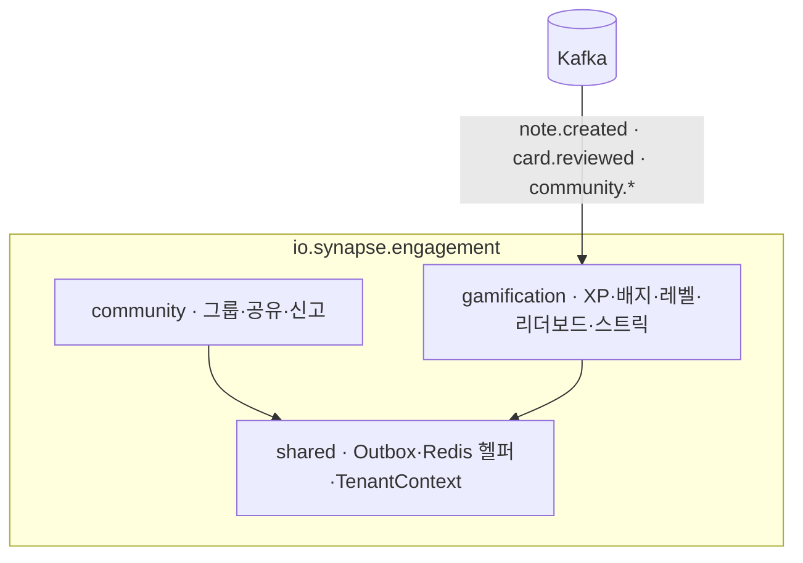

# engagement-svc 상세

사용자 **참여(engagement)** 도메인 — 커뮤니티 + 게임화. 두드러진 특성은 **이벤트 소비 중심**(다른 svc 활동을 보상으로 변환)과 **Redis Sorted Set 적극 활용**(리더보드·카운터)입니다.

## 한눈 요약

| 항목 | 값 |
|---|---|
| 스택 | Java 21, Spring Boot 4.0, Spring Modulith |
| 저장소 | PostgreSQL · **Redis(Sorted Set 핵심)** · Kafka |
| 배포 | 단일 Deployment + HPA(CPU+Kafka lag) |
| 배치 | CronJob 2개 — `streak-reset`(매일 00:05 KST), `leaderboard-rollover`(매주 월 00:00) |
| 특징 | 클라이언트가 XP를 직접 못 올림(이벤트만) |

## 모듈 구조



## `community` 모듈

**도메인**:
```
StudyGroup (Aggregate Root)
 ├ GroupSettings (visibility: PUBLIC/PRIVATE/UNLISTED, max_members)
 ├ Memberships — Role: OWNER / ADMIN / MEMBER
 ├ Invitations
 └ Shares — DeckShare / NoteShare (share_token)
Report (append-only) — reporter, target_type/id, status(PENDING/REVIEWED/DISMISSED)
```

**비즈니스 규칙**:
- 신고는 동일 사용자가 동일 타겟에 1회만(UNIQUE), 사용자당 **일 10건 제한**(Redis 카운터)
- 공유 시 `share_token`(UUID) 발급 — 링크 공유는 토큰 기반 접근
- 그룹 가입 = 초대 수락 **또는** 가입 신청 + owner/admin 승인

**Port → Adapter**:

| Port | Adapter | 대상 |
|---|---|---|
| `CardDeckCopyPort` | `CardDeckGrpcAdapter` | learning-card `DeckService.Copy` |
| `NoteReadPort` | `NoteGrpcAdapter` | knowledge `NoteService.GetForLearning` |
| `UserPort` | `UserApiAdapter` | platform `UserService.GetById` |
| `RateLimitPort` | `RedisRateLimitAdapter` | Redis(`comm:report:rate:*`) |
| `GroupCachePort` | `RedisGroupCacheAdapter` | Redis(그룹 캐시) |
| `CommunityEventPublisher` | `CommunityEventKafkaAdapter`(Outbox) | Kafka(`community.*`) |

**REST** (`/api/v1/community/**`): `POST /groups`, `GET /groups`(public+joined), `GET /groups/{id}`, `POST /groups/{id}/join`, `POST /groups/{id}/invitations`, `PATCH /groups/{id}/members/{userId}`(역할), `DELETE …/members/{userId}`(강퇴), `POST /decks/{id}/share`, `POST /decks/shared/{token}/copy`, `POST /reports`.

**Kafka Consumer**: `user.deleted`(그룹/공유/신고 정리), `tenant.deleted`(일괄 삭제), `subscription.changed`(Free 플랜 그룹 1개 제한 같은 Feature Flag).

## `gamification` 모듈

**도메인**:
```
XpEvent (append-only)  — user, event_type, xp_amount, source, occurred_at
UserXp (mutable)       — total_xp, current_level, level_progress  ← XpEvent에서 파생
LevelDefinition (seed) — level 1~100, xp_required, title("노트 견습생"…)
Badge / UserBadge      — badge_code, criteria_json, xp_reward
UserStreak (mutable)   — current/longest_streak, last_activity_date
Leaderboard            — type(weekly_xp…), period, entries(Redis ZSET 백업)
```

> 💡 **개념: append-only / Event Sourcing 부분 적용**
> `xp_events`는 추가만 하고 수정하지 않는 로그입니다. 현재 상태(`user_xp.total_xp`)는 이 이벤트들에서 파생됩니다. "무슨 일이 있었는가"의 사실을 보존해 재계산·감사·디버깅이 쉬워집니다.

### XP는 이벤트로만 적립된다

거의 전적으로 **Kafka 이벤트를 소비**해 XP를 적립합니다. **클라이언트가 XP를 직접 올리는 API는 없습니다**(조작 방지).

| 소비 이벤트 | 보상 |
|---|---|
| `note.created` | +10 XP |
| `card.reviewed` | +5 XP (+정답률 보너스) |
| `card.review.session.completed` | +20 XP |
| `community.group.joined` | +15 XP |
| `community.deck.shared` | +30 XP |
| `graph.notes.linked` | +2 XP |

### XP Cap (어뷰징 방지)

| 위험 | 대응 |
|---|---|
| 같은 행위 폭주 | 일별/시간별 XP cap(예: 노트 작성 일 100점) |
| 봇/자동화 | Rate Limit + 비정상 패턴 탐지(분당 10+ 노트 → 보류) |
| 이벤트 중복 | `processed_events` 멱등성 |
| 리더보드 조작 | 사용자 직접 적립 불가(이벤트만) |

```java
// XpCapPolicy
DailyCap cap = CAPS.get(type);   // 예: NOTE_CREATED → (10회, 100XP)
int todayCount = counterRepo.getTodayCount(userId, type);
if (todayCount >= cap.maxOccurrences()) return 0;
int remaining = cap.maxXp() - counterRepo.getTodayXp(userId, type);
return Math.min(baseXp, Math.max(0, remaining));
```

### 배지 평가 엔진

`criteria_json`을 `BadgeCriteriaEvaluator`(SpEL 또는 자체)가 평가:
```json
{ "type":"AND", "conditions":[
  {"metric":"notes_created","operator":">=","value":10},
  {"metric":"consecutive_days","operator":">=","value":7} ]}
```
단순 카운터 조건은 XpEvent 직후 **즉시**, 스트릭·누적 같은 복잡 조건은 **일 1회 Cron**(`badge:eval:queue` Stream).

### 리더보드 (Redis Sorted Set)

```java
String key = "lb:weekly_xp:2026-W20";
redis.opsForZSet().incrementScore(key, userId, xpAmount);   // 적립
redis.opsForZSet().reverseRangeWithScores(key, 0, 9);       // Top 10
redis.opsForZSet().reverseRank(key, userId);                // 본인 순위
```
AOF+RDB 동시 활성화 + 매일 자정 `leaderboard_entries`로 스냅샷 백업 → Redis 장애 시 DB에서 복구.

**Port → Adapter**:

| Port | Adapter | 대상 |
|---|---|---|
| `ProgressPort` | `LearningProgressGrpcAdapter` | learning-card `ProgressService.GetStats` |
| `UserDirectoryPort` | `UserGrpcAdapter` | platform `UserService.BatchGetByIds` |
| `LeaderboardStore` | `RedisLeaderboardAdapter` | Redis Sorted Set |
| `XpEventStore` | `JpaXpEventAdapter` | PostgreSQL(append-only) |
| `BadgeCriteriaEvaluator` | `ExpressionEvaluatorAdapter` | criteria_json |
| `GamificationEventPublisher` | Kafka(Outbox) | `gamification.*` |

**REST** (`/api/v1/gamification/**`): `GET /me`, `/badges`, `/leaderboards/{type}`, `/streak`, `/xp/history`.
**gRPC 제공**: `BadgeService.InitForUser`(platform auth가 가입 시 호출 → 환영 배지).
**Kafka Producer**: `gamification.xp.earned/badge.earned/level.up`.

## 데이터

**PostgreSQL**: `study_groups`·`group_memberships`·`group_invitations`(TTL 7d)·`deck_shares`·`note_shares`·`deck_copies`·`reports`(UNIQUE reporter+target) / `xp_events`·`user_xp`·`level_definitions`·`badge_definitions`·`user_badges`·`user_streaks`·`leaderboard_periods`·`leaderboard_entries`.

**Redis**:

| 키 | 자료구조 | 용도 |
|---|---|---|
| `lb:weekly_xp:{period}` 등 | Sorted Set | 리더보드 |
| `streak:user:{id}` | Hash | 현재 스트릭 |
| `xp:counter:{userId}:{type}:{date}` | Counter | 일별 XP(Cap) |
| `badge:eval:queue` | Stream | 복잡 조건 평가 대기 |
| `comm:report:rate:{userId}:{date}` | Counter | 신고 빈도 |
| `comm:group:cache:{groupId}` | Hash | 그룹 상세 |

## 관측성

`gamification_xp_awarded_total{eventType}`, `gamification_badge_earned_total`, `gamification_level_up_total`, `leaderboard_calculation_seconds`, `community_reports_total`, `redis_sorted_set_size`. 알람: gamification Kafka lag>500, 배지 평가 p95>100ms, Redis 메모리>80%.

## 보안

그룹 접근 RLS(PUBLIC or 멤버), 공유는 RLS+share_token, 신고자 정보는 관리자만, 리더보드 기본 테넌트 내(글로벌 opt-in), XP 적립은 이벤트만, 배지 수동 부여는 `tenant.owner`만.

## 트러블슈팅

| 증상 | 원인 | 해결 |
|---|---|---|
| 리더보드 비어 있음 | Redis 키 만료/ZSET 누락 | `leaderboard_entries`에서 복구·재계산 |
| 배지 미부여 | criteria 평가 실패/consumer lag | 로그 확인, 수동 재평가 API |
| XP 중복 적립 | 멱등성 누락 | `processed_events` UNIQUE + Redis SETNX |
| 스트릭 끊김(실제 활동함) | TZ 불일치/cron 지연 | 사용자 TZ 기준 활동일 보정 |
| 공유 덱 복사 실패 | learning gRPC deadline 초과 | Resilience4j Retry, 비동기 폴백 |

## 안티패턴 (03-D)

- ❌ Controller가 `RedisTemplate` 직접 호출 → `LeaderboardStore` Port
- ❌ Kafka Listener에 비즈니스 로직 → UseCase로
- ❌ XP 적립을 클라이언트 API로 노출 → 이벤트 기반만
- ❌ Community가 learning gRPC stub import → `CardDeckCopyPort`만
- ❌ Badge `criteria_json`을 Entity에서 직접 파싱 → Evaluator로 분리

> ⚠️ **현재 상태**: 부트스트랩 초기(약 10 commits). 모듈 구조 일부는 platform-svc 패턴 기반 추정.

---
*출처: synapse-engagement-svc ARCHITECTURE v2.0 · Wiki 03/02/04 · 03-A/C/D. 서비스 간 연결은 [14. 서비스 간 상호작용 지도].*
