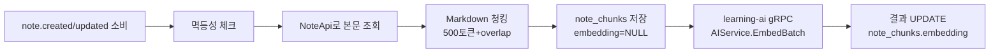

# knowledge-svc 상세

> 실제 레포 구조 기반 상세. 빠른 소개는 [03. 4개 서비스 소개], 연결 구조는 [14. 서비스 간 상호작용 지도].

Synapse 정체성의 **Core 도메인** — 노트, 위키링크 그래프, 검색. 한 가지 분담을 기억하세요: **AI 임베딩 "계산"은 이 서비스가 하지 않습니다.** 청크 텍스트만 만들어 learning-ai(Python)에 위임하고 결과를 저장합니다.

## 모듈 구성

| 모듈 | 책임 |
|---|---|
| `note` | Markdown CRUD, `[[위키링크]]` 파싱 → `note_links` 동기화, 버전 관리(`note_versions`), S3 첨부(Presigned URL), Elasticsearch 인덱싱 |
| `graph` | 백링크·인접 그래프·PageRank(일 1회)·클러스터링(주 1회 Louvain). 별도 Aggregate 없이 note 데이터를 재구성하는 **읽기 모델** |
| `chunking` | `note.*` 이벤트 소비 → 청크 분할(500토큰+50 overlap) → learning-ai에 임베딩 요청 → 결과를 `note_chunks`에 저장(pgvector) |
| `shared` | TenantContext, Outbox, CloudEvents, 멱등성 |

> 💡 **개념: CQRS 읽기 모델 (graph 모듈)**
> `graph`는 쓰기용 데이터를 따로 갖지 않고, `note`/`note_links`를 읽어 그래프(노드=노트, 엣지=링크)로 재구성합니다. "쓰기 모델"과 "읽기 모델"을 분리하는 CQRS의 가벼운 형태로, 무거운 그래프 연산을 본문 쓰기와 분리합니다.

## 청킹 흐름 (핵심)

이 흐름이 [05. 이벤트가 흐르는 길]의 "임베딩 생성" 단계의 실제 내부 구현입니다.

## 외부로 노출/의존하는 것

- **REST**: `/api/v1/notes/**`, `/notes/{id}/attachments`, `/search/notes`(Elasticsearch), `/graph/notes/{id}/backlinks|neighborhood`, `/graph/pagerank/top`, `/graph/clusters`
- **gRPC 제공**: `NoteService.GetForLearning`(learning-card가 카드 생성 시), `NoteService.UpdateChunks`(learning-ai가 임베딩 결과 콜백), `GraphService.GetBacklinksBatch`
- **gRPC 호출(의존)**: learning-ai `AIService.Embed/EmbedBatch`, platform `AuthService.Introspect`
- **Kafka Producer**: `note.created/updated/deleted`, `graph.notes.linked`, `chunk.generated`
- **Kafka Consumer**: `user.deleted`·`tenant.deleted`·`subscription.changed`(정리/플래그)

## 데이터

- **PostgreSQL + pgvector**: `notes`(soft delete)·`note_versions`·`note_links`·`note_chunks`. 벡터는 **HNSW 인덱스**(`vector_cosine_ops`, m=16). `note_pagerank`·`note_clusters`(배치 산출).
- **Elasticsearch 8 + nori**: `notes` 인덱스(한국어 형태소). `note.*` Listener가 색인 동기화.
- **S3**: `synapse-attachments-{env}`, Presigned PUT/GET(서버 미경유).
- **Redis**: 백링크·인접 그래프 캐시(5~10m).

## 다음 읽을거리

- [synapse-knowledge-svc ARCHITECTURE](https://github.com/team-project-final/documents/wiki/synapse-knowledge-svc_ARCHITECTURE) — Port/Adapter, HNSW 인덱스, gRPC proto
- [02 ERD 문서](https://github.com/team-project-final/documents/wiki/02_ERD_문서) · [04 API 명세서](https://github.com/team-project-final/documents/wiki/04_API_명세서)
