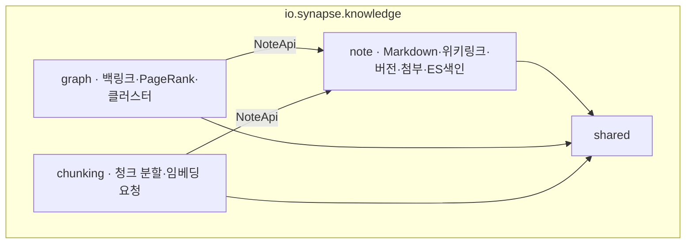
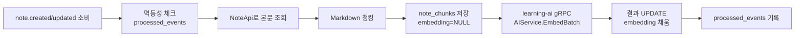

# knowledge-svc 상세

Synapse 정체성의 **Core 도메인** — 노트, 위키링크 그래프, 검색. 한 가지 분담을 기억하세요: **AI 임베딩 "계산"은 이 서비스가 하지 않습니다.** 청크 텍스트만 만들어 learning-ai(Python)에 위임하고 결과를 저장합니다.

## 한눈 요약

| 항목 | 값 |
|---|---|
| 스택 | Java 21, Spring Boot 4.0, Spring Modulith |
| 저장소 | **PostgreSQL + pgvector** · Elasticsearch 8(nori) · S3 · Redis · Kafka |
| 배포 | 단일 Deployment + HPA(CPU + chunking Kafka lag) |
| 분담 | 임베딩 계산은 learning-ai 위임, 이 레포는 청크 생성+결과 저장 |

## 모듈 구조



## `note` 모듈

**도메인**: `Note`(Aggregate), `NoteVersion`, `NoteLink`(위키링크), `NoteTag`, `Attachment`.

**비즈니스 규칙**:
- 본문은 Markdown 텍스트
- 저장 시 `[[위키링크]]`를 자동 파싱해 `note_links` 동기화
- 변경 시 직전 버전을 `note_versions`에 보관(최근 50개)
- 삭제는 소프트(`deleted_at`) → 30일 후 하드 삭제

**Port → Adapter**:

| Port | Adapter | 대상 |
|---|---|---|
| `ObjectStoragePort` | `S3AttachmentAdapter` | S3(Presigned URL) |
| `SearchIndexPort` | `ElasticsearchIndexAdapter` | Elasticsearch(`notes`, nori) |
| `MarkdownParserPort` | `CommonMarkAdapter` | CommonMark |
| `WikiLinkParserPort` | `WikiLinkParserAdapter` | 자체(정규식+토큰화) |
| `NoteEventPublisher` | `NoteEventKafkaAdapter`(Outbox) | Kafka |

## `graph` 모듈

별도 Aggregate가 없는 **CQRS 읽기 모델** — `note`/`note_links`를 읽어 그래프 재구성:
- 노드 = notes, 엣지 = note_links
- 가중치 = `note_pagerank`(일 1회 배치)
- 클러스터 = `note_clusters`(주 1회 Louvain)

**Port → Adapter**: `NoteReadPort→NoteApiAdapter`(모듈 간), `GraphAnalyticsPort→JpaGraphAdapter`(PG), `BacklinkCachePort→RedisBacklinkAdapter`(10m).
**REST**: `/graph/notes/{id}/backlinks`, `/neighborhood`, `/pagerank/top`, `/clusters`. **gRPC 제공**: `GraphService.GetBacklinksBatch`. **Cron**: PageRank(일 1회), Clustering(주 1회).

> 💡 **개념: CQRS 읽기 모델 / PageRank**
> `graph`는 쓰기 데이터를 따로 갖지 않고 note 데이터를 읽어 그래프를 만듭니다(Command/Query 분리의 가벼운 형태). **PageRank**는 "많이·중요하게 링크되는 노트일수록 높은 점수"를 주는 알고리즘으로 중요 노트 Top N을 뽑습니다.

## `chunking` 모듈 — 핵심 흐름

`NoteChunk`(note_id, chunk_index, content, token_count, embedding). 전략: **500 토큰 + 50 토큰 overlap**(코드블록/표 보존).



처리 단계: ① 멱등성 체크 → ② NoteApi로 본문 조회 → ③ Markdown 청킹 → ④ `note_chunks` 저장(embedding=NULL) → ⑤ learning-ai `AIService.Embed` gRPC(batch) → ⑥ 임베딩 결과 UPDATE → ⑦ `processed_events` 기록. 이것이 [05. 이벤트가 흐르는 길]의 "임베딩 생성" 단계의 실제 내부 구현입니다.

**Port → Adapter**: `NoteReadPort→NoteApiAdapter`, `ChunkRepository→JpaChunkAdapter`(pgvector), `AIEmbeddingPort→AIServiceGrpcAdapter`(learning-ai), `ChunkingEventPublisher→Kafka`(`chunk.generated`).

## REST API

| 경로 | 모듈 |
|---|---|
| `/api/v1/notes/**` | note (CRUD·버전·위키링크) |
| `/api/v1/notes/{id}/attachments` | note (Presigned URL) |
| `/api/v1/search/notes` | note (Elasticsearch 풀텍스트) |
| `/api/v1/graph/notes/{id}/backlinks` · `/neighborhood` | graph |
| `/api/v1/graph/pagerank/top` · `/clusters` | graph |

## gRPC (내부)

```protobuf
service NoteService {
  rpc GetForLearning(...) returns (NoteForLearning);  // learning-card 호출
  rpc UpdateChunks(...) returns (...);                // learning-ai 임베딩 콜백
}
service GraphService { rpc GetBacklinksBatch(...) returns (...); }
```
**의존(gRPC)**: learning-ai `AIService.Embed/EmbedBatch`, platform `AuthService.Introspect`(모든 REST).

## Kafka

**Producer**(Outbox): `note.created/updated/deleted`, `graph.notes.linked`, `chunk.generated`.
**Consumer**: `note.*`→chunking(Kafka 경유 디커플링), `user.deleted`·`tenant.deleted`·`subscription.changed`→note.

## 데이터

**PostgreSQL + pgvector** (RLS):

| 테이블 | 모듈 | 비고 |
|---|---|---|
| `notes` | note | soft delete |
| `note_versions` | note | 최근 50개 |
| `note_links` | note | source/target 인덱스 |
| `note_tags`·`note_attachments` | note | M:N / S3 키 |
| `note_chunks` | chunking | `embedding vector(N)`, HNSW |
| `note_pagerank`·`note_clusters` | graph | 배치 산출 |
| `outbox_event`·`processed_events` | 전 모듈 | Outbox/멱등성 |

**HNSW 인덱스**:
```sql
CREATE INDEX idx_note_chunks_embedding ON note_chunks
  USING hnsw (embedding vector_cosine_ops) WITH (m = 16, ef_construction = 64);
```

**Elasticsearch 8 + nori**: 인덱스 `notes`(테넌트 필터), `title`/`content`(nori), `tags`(keyword). `note.*` Listener가 동기화.
**S3**: 버킷 `synapse-attachments-{env}`, 키 `{tenant}/{note}/{attachment}/{file}`, Presigned PUT(업로드)/GET(다운로드 1h).
**Redis**: `note:hot:*`(5m), `graph:backlinks:*`(10m), `graph:neighborhood:*`(5m).

> 💡 **개념: pgvector / HNSW / nori**
> **pgvector** = PostgreSQL에 벡터(임베딩)를 저장·검색하는 확장. **HNSW** = "비슷한 벡터"를 빠르게 찾는 근사 최근접 이웃 인덱스. **nori** = 한국어를 형태소로 쪼개 Elasticsearch가 한글 검색을 잘하게 하는 분석기.

## 관측성

`note_operations_total`, `note_search_duration_seconds`, `chunking_processed_total`, `chunking_duration_seconds`, `graph_pagerank_duration_seconds`, `elasticsearch_sync_lag_seconds`. 알람: ES lag>60s, chunking lag>1000, PageRank 배치 실패.

## 보안

노트 접근 RLS(`tenant_id`+`user_id`), 첨부 Presigned URL+서버 권한 재확인, 위키링크는 표시 자유·클릭 시 권한 검증, Markdown 서버 sanitize(XSS), AI 호출 시 TenantContext를 gRPC metadata로 전파.

## 트러블슈팅

| 증상 | 원인 | 해결 |
|---|---|---|
| pgvector 쿼리 느림 | HNSW 누락/`ef_search` 낮음 | `SET hnsw.ef_search = 100` |
| ES 검색 누락 | 인덱싱 lag | consumer lag 확인·강제 reindex |
| 위키링크 깨짐(이름 변경) | `note.updated` 처리 누락 | 백링크 갱신 트리거 확인 |
| 청크 너무 많음 | 노트 큼+overlap 큼 | 청크 정책 재검토 |
| PageRank 이상값 | 그래프 sparse | 최소 임계치(노드 10+) |

## 안티패턴 (03-D)

- ❌ Controller가 Elasticsearch RestClient 직접 호출 → `SearchIndexPort`
- ❌ chunking이 learning gRPC stub import → `AIEmbeddingPort`
- ❌ graph가 `note.internal.NoteRepository` import → `NoteApi`
- ❌ S3 키를 Aggregate에 노출 → Attachment VO에 캡슐화
- ❌ pgvector 쿼리를 도메인 서비스에서 직접 작성 → Repository로

> ⚠️ **현재 상태**: 부트스트랩 초기(약 10 commits). 모듈 구조 일부는 platform-svc 패턴 기반 추정.

---
*출처: synapse-knowledge-svc ARCHITECTURE v2.0 · Wiki 03/02/04 · 03-A/B/C/D. 서비스 간 연결은 [14. 서비스 간 상호작용 지도].*
