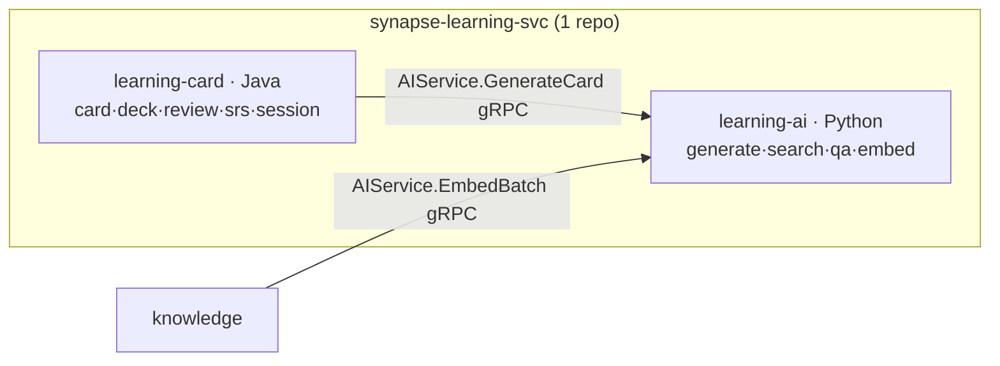

# learning-svc 상세

가장 큰 서비스이자 유일한 **폴리글랏 레포**. 단일 GitHub 레포 안에 Java와 Python 디렉토리가 분리되어 있고, **Docker 이미지·K8s Deployment가 각각 2개**입니다.

## 한눈 요약

| 서브 프로젝트 | 언어 | 책임 | 이미지 |
|---|---|---|---|
| `learning-card/` | Java/Spring Boot 4 | 카드/덱 CRUD, SRS 스케줄링, 복습 큐·세션·통계 | `synapse-learning-card` |
| `learning-ai/` | Python/FastAPI | 카드 자동 생성, 시맨틱/하이브리드 검색, RAG Q&A, 시맨틱 캐시, 사용량 추적 | `synapse-learning-ai` |

> ⚠️ 폴리글랏 레포 — `settings.gradle.kts`는 Java(learning-card)만 다루고, Python(learning-ai)은 Poetry로 별도 관리.



---

## A. learning-card (Java)

모듈: `card` · `deck` · `review` · `srs` · `session` · `shared`(Spring Modulith).

**도메인**:
```
Deck (Aggregate Root) ├ DeckSettings └ Cards(1:N)
Card (Aggregate Root) ├ CardContent(front/back/cloze) ├ SrsState(interval,ease_factor,due_date) └ ReviewHistory
ReviewSession (Aggregate) ├ startedAt/completedAt ├ targetCount ├ Reviews(N) └ stats
```

### SM-2 알고리즘 (`srs` 모듈, 도메인 정책)

복습 평가 `AGAIN(1)/HARD(2)/GOOD(3)/EASY(4)`로 다음 복습일을 계산합니다.

```java
public SrsState calculateNext(SrsState current, ReviewRating rating) {
    if (rating == ReviewRating.AGAIN) {
        return new SrsState(0, Math.max(1.3, current.easeFactor() - 0.2), 0,
            Instant.now().plus(Duration.ofMinutes(10)));   // 10분 뒤 재시도
    }
    int reps = current.repetitions() + 1;
    double ef = current.easeFactor()
        + (0.1 - (4 - rating.value()) * (0.08 + (4 - rating.value()) * 0.02));
    ef = Math.max(1.3, ef);
    int interval = switch (reps) {
        case 1 -> 1;          // 1일
        case 2 -> 6;          // 6일
        default -> (int) Math.round(current.interval() * ef);
    };
    return new SrsState(interval, ef, reps, Instant.now().plus(Duration.ofDays(interval)));
}
```

> 💡 **개념: SRS / SM-2 / ease factor**
> SRS(간격 반복)는 "잊을 때쯤" 다시 보여 주는 복습 기법입니다. SM-2는 사용자가 매긴 난이도로 다음 간격을 정합니다. **ease factor**(기본 2.5, 최저 1.3)는 카드의 "쉬운 정도"로, 쉬울수록 간격이 빠르게 늘어납니다. ⚠️ FSRS 알고리즘으로 점진 전환(dual-write) 검토 중.

**Port → Adapter**: `NotePort→NoteGrpcAdapter`(knowledge), `AICardGeneratorPort→AIServiceGrpcAdapter`(learning-ai), `UserPort→UserGrpcAdapter`(platform), `CardEventPublisher→Kafka`(Outbox), `ReviewQueueCachePort→RedisReviewQueueAdapter`, `DeckCopyPort`(inbound — community가 호출).

**REST**: `/api/v1/cards/**`, `/decks/**`, `/reviews/**`, `/sessions/**`.
**gRPC 제공**: `ProgressService.GetStats`(engagement 호출), `DeckService.Copy`(community 호출).
**Kafka Producer**(Outbox): `card.created/updated/deleted`, `card.reviewed`, `card.review.due`(일 1회 배치).
**Kafka Consumer**: `user.deleted`·`tenant.deleted`(정리), `subscription.changed`(AI 호출 한도 등 Feature Flag), `chunk.generated`(자동 카드 생성 대기 — Phase 2).

---

## B. learning-ai (Python/FastAPI)

헥사고날 구조 — `domain/port` + `infrastructure/adapter`로 LLM·검색·캐시를 모두 Port로 추상화. 진입점 `ai_service/main.py`, REST(`api/routes`) + gRPC(`grpc/ai_servicer.py`).

**Port → Adapter**:

| Port | Adapter | 대상 |
|---|---|---|
| `LLMPort` | `OpenAIAdapter` / `AnthropicAdapter`(fallback) | OpenAI / Anthropic |
| `RerankerPort` | `CohereRerankerAdapter`(선택) | Cohere rerank |
| `VectorStorePort` | `PgvectorAdapter`(읽기 전용) | pgvector(knowledge schema) |
| `SearchIndexPort` | `ElasticsearchAdapter` | Elasticsearch(BM25) |
| `NoteUpdatePort` | `NoteGrpcAdapter` | knowledge `NoteService.UpdateChunks` |
| `CachePort` | `RedisCacheAdapter` | Redis(시맨틱 캐시) |
| `UsageRecorderPort` | `PostgresUsageAdapter` | `ai_usage_logs` |

### LLM 모델 전략

| 작업 | 1차 | Fallback |
|---|---|---|
| 카드 생성 | OpenAI `gpt-4o-mini` | Anthropic `claude-3-haiku` |
| Q&A(RAG) | OpenAI `gpt-4o` | Anthropic `claude-3-5-sonnet` |
| 임베딩 | OpenAI `text-embedding-3-small` | (없음 — 일관성 중요) |
| Reranker | Cohere `rerank-multilingual-v3.0` | BM25+벡터 RRF |

### RAG 파이프라인 (QaUseCase)

```
1. CachePort.find_similar_cached(query)        # 시맨틱 캐시 (유사도 ≥ 0.95)
2. if cached: return cached
3. embedding = LLMPort.embed(query)
4. vec  = VectorStorePort.search(embedding, top_k=20, tenant_id)
5. bm25 = SearchIndexPort.search(query, top_k=20, tenant_id)
6. merged = RRF(vec, bm25, top_k=10)           # 두 검색 결과 융합
7. (선택) reranked = RerankerPort.rerank(query, merged, top_k=5)
8. stream = LLMPort.generate_stream(system, context, query)   # SSE
9. async for chunk in stream: yield chunk
10. UsageRecorderPort.record(user, tenant, model, tokens, ...)
11. CachePort.cache_response(query, embedding, full_response)
```

> 💡 **개념: RAG / 하이브리드 검색(RRF) / 시맨틱 캐시**
> **RAG** = 먼저 내 자료에서 관련 문서를 찾고(retrieval) 그걸 근거로 답을 생성(generation). 환각을 줄이고 출처를 댑니다. **RRF**(Reciprocal Rank Fusion) = 의미 검색과 키워드(BM25) 검색의 순위를 합쳐 더 좋은 결과를 뽑는 기법. **시맨틱 캐시** = 의미가 거의 같은(코사인 ≥ 0.95) 과거 질문의 답을 재사용해 토큰 비용을 아낍니다.

**REST(SSE)**: `POST /api/v1/ai/cards/generate`(스트리밍), `/ai/search/semantic`, `/ai/search/hybrid`, `/ai/qa`(스트리밍).
**gRPC 제공**: `AIService.Embed/EmbedBatch`(knowledge chunking 호출), `AIService.GenerateCard`(server-streaming, learning-card 호출).
**Kafka Producer**: `ai.usage.recorded`(향후 billing 소비). Consumer: 없음(요청 기반).

### learning-card ↔ learning-ai
같은 "서비스"지만 다른 컨테이너이므로 같은 프로세스가 아니라 **gRPC**로 통신합니다. 카드 자동 생성은 card → ai `GenerateCard`(서버 스트리밍), 임베딩은 knowledge → ai `EmbedBatch`.

---

## 데이터

**PostgreSQL**: `decks`·`cards`·`srs_states`(1:1 cards)·`reviews`(append-only)·`review_sessions` / `ai_usage_logs`(토큰·비용, append-only, UNIQUE request_id)·`semantic_cache` / `outbox_event`·`processed_events`.
**pgvector**: learning-ai는 `knowledge.note_chunks`를 **읽기 전용**으로 사용(쓰기는 knowledge가).

**Redis**:

| 키 | 영역 | 용도 | TTL |
|---|---|---|---|
| `card:due:{userId}:{date}` | card | 오늘 due 카드 ID | 자정 갱신 |
| `card:session:{id}` | card | 진행 중 세션 | 1h |
| `ai:cache:{queryHash}` | ai | 시맨틱 캐시 | 7d |
| `ai:ratelimit:{userId}:{window}` | ai | 호출 빈도 | 1m/1h/1d |
| `ai:streaming:{sessionId}` | ai | SSE 진행 | 30s |

## 빌드 / 배포

```bash
# learning-card (Java)
cd learning-card && ./gradlew build test --tests "*ModuleStructureTest"
# learning-ai (Python)
cd learning-ai && poetry install && poetry run pytest
```
이미지 2개(`synapse-learning-card`, `synapse-learning-ai`). HPA: card=CPU+요청률, ai=CPU+큐 lag(LLM I/O 바운드, workers 다수).

## 관측성

`card_reviews_total{rating}`, `card_sm2_calculation_seconds`, `ai_generation_total{model,cardType}`, `ai_tokens_used_total{model,type,tenant}`, `ai_cache_hit_rate`, `ai_quota_exceeded_total`. learning-ai는 `structlog` JSON 로깅. 추적: Java=OTel Agent, Python=`opentelemetry-instrumentation-fastapi/grpc`.

## 보안

카드/리뷰 RLS, AI 호출은 Gateway JWT + TenantContext 전파, OpenAI 키는 Secrets Manager + `pydantic.SecretStr`, **Prompt Injection 방어**(system/user 분리·output sanitize), 사용량 무결성(`ai_usage_logs` append-only).

## 트러블슈팅

| 증상 | 원인 | 해결 |
|---|---|---|
| SRS due 누락 | TZ 불일치(UTC↔KST) | TIMESTAMPTZ, 계산 UTC·표시 사용자 TZ |
| AI 응답 느림 | 컨텍스트 큼 | 청크 Top 5 제한, max_tokens↓ |
| AI quota 초과 | Free 플랜 정상 | UI 안내 + 업그레이드 CTA |
| 시맨틱 캐시 부정확 | threshold 낮음 | 0.95 → 0.97 |
| Card→AI deadline 초과 | AI 30s+ | gRPC streaming, 클라이언트 SSE 직접 |

## 안티패턴 (03-D)

- ❌ UseCase가 `openai.AsyncClient` 직접 호출 → `LLMPort`만
- ❌ Card가 `AIServiceBlockingStub` import → `AICardGeneratorPort`
- ❌ proto 모델을 도메인 Card에 노출 → Mapper 변환
- ❌ Adapter에 비즈니스(RRF 점수 계산 등) → UseCase로

> ⚠️ **현재 상태**: 부트스트랩 초기(약 12 commits). `learning-card/`+`learning-ai/` 골격 분리 확인됨, 구체 구현은 향후.

---
*출처: synapse-learning-svc ARCHITECTURE v2.0 · Wiki 03/02/04 · 03-A/B/C/D. 유저 시나리오는 [06. 핵심 유저 플로우 E2E], 서비스 간 연결은 [14. 서비스 간 상호작용 지도].*
