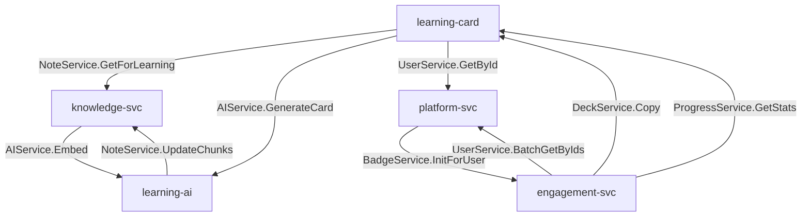
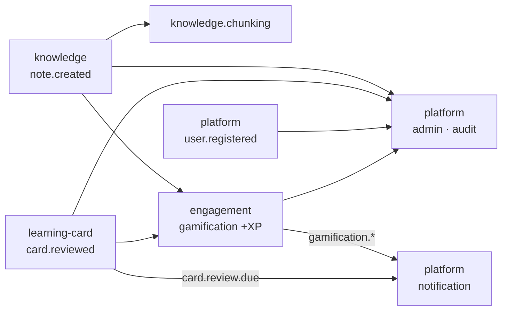

# 서비스 간 상호작용 지도

[06. 핵심 유저 플로우 E2E]가 *"사용자 입장의 시나리오"* 였다면, 이 장은 *"엔지니어 입장의 배선도"* 입니다. 4개 서비스가 **어떤 채널로, 누가 누구를** 호출·구독하는지 한 장에 모읍니다.

> 💡 **개념: 세 가지 통신 채널**
> SYNAPSE의 서비스들은 상황에 따라 세 방식으로 통신합니다.
> - **REST (Gateway 경유)** — 클라이언트 ↔ 서비스. 외부 진입은 모두 게이트웨이를 거칩니다.
> - **gRPC (서비스 메시, mTLS)** — 서비스 ↔ 서비스의 *동기* 호출. 게이트웨이를 거치지 않고 내부망에서 직접, 즉답이 필요한 조회/명령에 사용.
> - **Kafka (이벤트)** — 서비스 ↔ 서비스의 *비동기* 통지. 발행자는 소비자를 모릅니다([05. 이벤트가 흐르는 길]).
> 원칙: **즉답이 필요하면 gRPC, 알리기만 하면 Kafka.**

## 1. gRPC 동기 호출 지도

| 제공자 (서버) | 엔드포인트 | 호출자 (클라이언트) | 용도 |
|---|---|---|---|
| knowledge | `NoteService.GetForLearning` | learning-card, engagement | 카드 생성·공유 시 노트 본문 |
| knowledge | `NoteService.UpdateChunks` | learning-ai | 임베딩 결과 콜백 |
| knowledge | `GraphService.GetBacklinksBatch` | (내부) | 백링크 일괄 |
| learning-ai | `AIService.Embed / EmbedBatch` | knowledge(chunking) | 청크 임베딩 |
| learning-ai | `AIService.GenerateCard` | learning-card | 카드 자동 생성(스트리밍) |
| learning-card | `DeckService.Copy` | engagement(community) | 공유 덱 복사 |
| learning-card | `ProgressService.GetStats` | engagement(gamification) | 학습 통계 |
| platform | `UserService.GetById / BatchGetByIds` | learning-card, engagement | 사용자 정보 |
| platform | `AuthService.Introspect` | **모든 서비스** | REST 요청 인증 검증 |
| engagement | `BadgeService.InitForUser` | platform(auth) | 신규 가입 환영 배지 |

> 가장 중요한 한 줄: **모든 서비스의 모든 REST 처리는 platform `AuthService.Introspect`로 토큰을 검증**합니다(위 그림에선 생략 — 너무 많아서). platform이 인증의 단일 진실원입니다.

## 2. Kafka 이벤트 흐름

| 토픽 | 발행 | 주요 소비 |
|---|---|---|
| `note.created/updated/deleted` | knowledge | knowledge(chunking·ES색인), engagement(+XP), admin(감사) |
| `graph.notes.linked` | knowledge | engagement(+XP) |
| `card.reviewed` | learning-card | engagement(+XP), admin |
| `card.review.due` | learning-card(배치) | platform(notification — 복습 리마인더) |
| `community.*` | engagement | platform(notification), admin |
| `gamification.xp/badge/level` | engagement | platform(notification), admin |
| `user.registered/deleted` | platform(auth) | admin, 그리고 **거의 모든 서비스**(정리) |
| `ai.usage.recorded` | learning-ai | (향후) billing |

## 3. 가로지르는 두 패턴

- **감사(admin)는 모든 것을 듣는다** — platform의 `admin` 모듈은 전 시스템 도메인 이벤트를 구독해 `audit_logs`에 적재합니다.
- **수명주기 정리** — `user.deleted` / `tenant.deleted`가 발행되면 knowledge·learning·engagement가 각자 자기 데이터를 정리합니다(느슨한 결합 덕분에 platform은 누가 듣는지 몰라도 됩니다).

> 💡 **개념: Outbox 패턴 / 멱등성**
> 서비스가 "DB 저장 + Kafka 발행"을 안전하게 하려고, 먼저 `outbox_event` 테이블에 같은 트랜잭션으로 기록한 뒤 별도 발행기가 Kafka로 보냅니다(유실 방지). 소비 측은 `processed_events`로 같은 이벤트를 두 번 처리하지 않게 막습니다(멱등성). 네 서비스의 `shared` 모듈이 공통으로 제공합니다.

## 한눈 요약

- **동기 즉답** = gRPC (내부망, mTLS). knowledge ↔ learning-ai(임베딩), learning-card → learning-ai(카드 생성)가 가장 빈번.
- **비동기 통지** = Kafka. note/card 활동 → 게임화·알림·감사로 fan-out.
- **인증** = 항상 platform. **감사** = 항상 platform.admin이 전량 수집.

## 다음 읽을거리

- [03-D 서비스간 호출 어댑터 표준](https://github.com/team-project-final/documents/wiki/03-D_서비스간_호출_어댑터_표준) — gRPC/REST/Kafka 어댑터 규칙
- [03-A 통신 운영 상세서](https://github.com/team-project-final/documents/wiki/03-A_통신_운영_상세서) — Outbox·멱등성·Resilience
- [03-C 이벤트 스키마 진화 가이드](https://github.com/team-project-final/documents/wiki/03-C_이벤트_스키마_진화_가이드)
